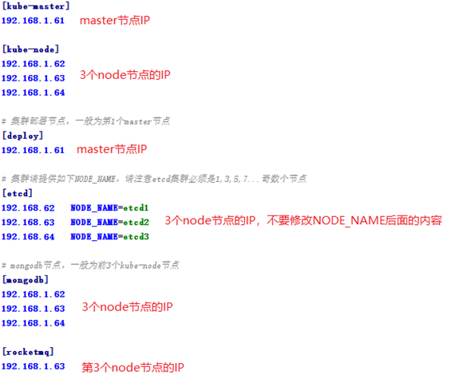

## SourceID部署步骤

本文以SourceID 1.4为例描述在开发、测试环境部署SourceID的步骤，生产环境部署请使用《SourceID部署操作说明.docx》。

#### 1. 准备

1. 安装基础工具wget，如果wget已经存在可以跳过这一步
    ```bash
    yum install -y wget
    ```
1. 安装Ansible
    ```bash
    yum install -y ansible
    ```
1. 下载自动化部署工具的安装包
    ```bash
    cd /opt
    wget http://172.17.8.20:8081/repository/files/ruijie/kad/release/kad-0.9.0.tar.gz
    ```
1. 解压
    ```bash
    tar xzvf kad-0.9.0.tar.gz
    ```
1. 下载SourceID安装包
    ```bash
    cd /opt/kad/down/
    wget http://172.17.8.20:8081/repository/files/ruijie/sourceid/kad/sourceid-kad-r1.4.2.zip
    ```
1. 下载SourceID镜像
    ```bash
    cd /opt/kad/down/
    wget http://172.17.8.20:8081/repository/files/ruijie/sourceid/images/sourceid-images-r1.4.tar.gz
    tar xzvf sourceid-images-r1.4.tar.gz
    ```

#### 2. 设置K8S部署参数

修改`workspace/inventory/hosts.ini`文件，参照下图进行设置：




#### 3. 设置SourceID部署参数

修改`workspace/inventory/group_vars/all.yml`文件，根据文件提示修改以下参数：

```
#SourceId发布版本号
SOURCEID_RELEASE_VERSION="r1.4.2"

#SSO域名
SOURCEID_SSO_DOMAIN="id.example.com"

#自助和管理端域名
SOURCEID_GATE_DOMAIN="id-self.example.com"

#二次认证网关地址
SOURCEID_GATEWAY_URL="http://gateway.example.com"

#登录成功后的跳转地址
SOURCEID_REDIRECT_URL="http://www.baidu.com"

#数据库管理员账号，只能由大/小写字母、数字、下划线组成，长度3~16字符
MONGODB_ADMIN_USER="admin"

#数据库管理员密码，只能由大/小写字母、数字、下划线组成，至少1个大写字母，1个小写字母和1个数字，长度6~16字符
MONGODB_ADMIN_PWD=""

#部署规模：small, normal。normal为标准规模，small主要用于开发、测试
CLUSTER_SCALE: "small"

#部署模式：dev, prd。dev模式下会多一些和开发、测试有关的配置参数，比如sso服务器的hostAlias
SOURCEID_DEPLOY_PROFILE: "dev"
```

注意：
- `SOURCEID_RELEASE_VERSION`参数是产品发布版本号，不是Docker镜像的版本号，必须根据产品发布文档进行设置
- 开发和UAT测试环境需要额外设置以下参数（内存占用少，开启测试开关）：
    ```
    CLUSTER_SCALE="small"
    SOURCEID_DEPLOY_PROFILE="dev"
    ```
- 性能测试环境需要额外设置以下参数（标准部署，开启测试开关）：
    ```
    CLUSTER_SCALE="normal"
    SOURCEID_DEPLOY_PROFILE="dev"
    ```

#### 4. 执行部署

按以下步骤操作：

1. 执行部署命令（在`/opt/kad`目录下执行）
    ```bash
    ansible-playbook -i workspace/inventory/ playbooks/sourceid/0-all.yml -k
    ```
1. 出现如下输入密码的提示信息后，输入root用户的密码
    ```
    SSH password:
    ```
1. 等待脚本运行完成。部署成功会显示如下信息
    ```
    PLAY RECAP *************************************************************
    192.168.1.61            : ok=xx   changed=xx   unreachable=0    failed=0
    192.168.1.62            : ok=xx   changed=xx   unreachable=0    failed=0
    192.168.1.63            : ok=xx   changed=xx   unreachable=0    failed=0
    192.168.1.64            : ok=xx   changed=xx   unreachable=0    failed=0
    ```
